Jenny Bryan  


Note: this HTML is made by applying `knitr::spin()` to an R script. So the
narrative is very minimal.


```r
library(ggplot2)
```

pick a way to load the data


```r
#gdURL <- "http://tiny.cc/gapminder"
#gapminder <- read.delim(file = gdURL) 
#gapminder <- read.delim("gapminderDataFiveYear.tsv")
library(gapminder)
str(gapminder)
```

```
## 'data.frame':	1704 obs. of  6 variables:
##  $ country  : Factor w/ 142 levels "Afghanistan",..: 1 1 1 1 1 1 1 1 1 1 ...
##  $ continent: Factor w/ 5 levels "Africa","Americas",..: 3 3 3 3 3 3 3 3 3 3 ...
##  $ year     : num  1952 1957 1962 1967 1972 ...
##  $ lifeExp  : num  28.8 30.3 32 34 36.1 ...
##  $ pop      : num  8425333 9240934 10267083 11537966 13079460 ...
##  $ gdpPercap: num  779 821 853 836 740 ...
```

```r
ggplot(gapminder, aes(x = gdpPercap, y = lifeExp)) # nothing to plot yet!
```

```
## Error: No layers in plot
```

```r
p <- ggplot(gapminder, aes(x = gdpPercap, y = lifeExp)) # just initializes
```

scatterplot


```r
p + geom_point()
```

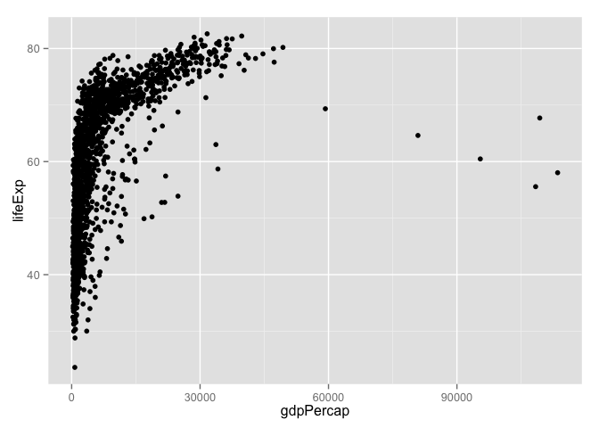 

```r
#p + layer(geom = "point")
```

log transformation ... quick and dirty


```r
ggplot(gapminder, aes(x = log10(gdpPercap), y = lifeExp)) + geom_point()
```

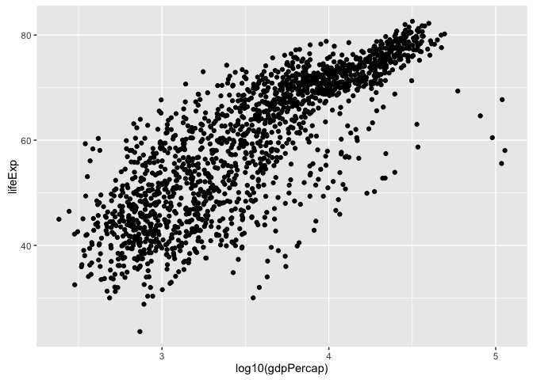 

a better way to log transform


```r
p + geom_point() + scale_x_log10()
```

 

let's make that stick


```r
p <- p + scale_x_log10()
```

common workflow: gradually build up the plot you want  
re-define the object 'p' as you develop "keeper" commands  
convey continent by color: MAP continent variable to aesthetic color


```r
p + geom_point(aes(color = continent))
```

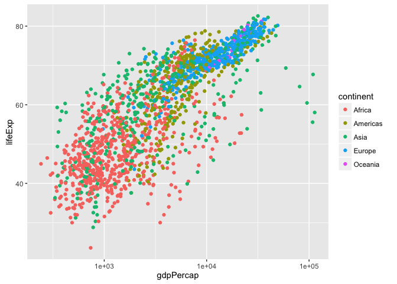 

```r
ggplot(gapminder, aes(x = gdpPercap, y = lifeExp, color = continent)) +
  geom_point() + scale_x_log10() # in full detail, up to now
```

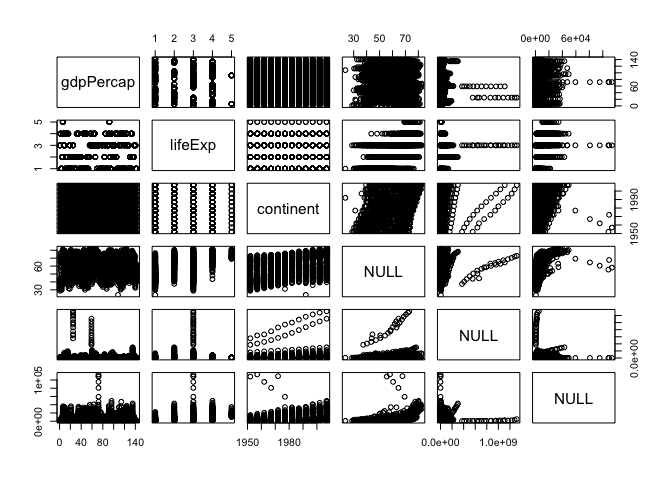 

address overplotting: SET alpha transparency and size to a value


```r
p + geom_point(alpha = (1/3), size = 3)
```

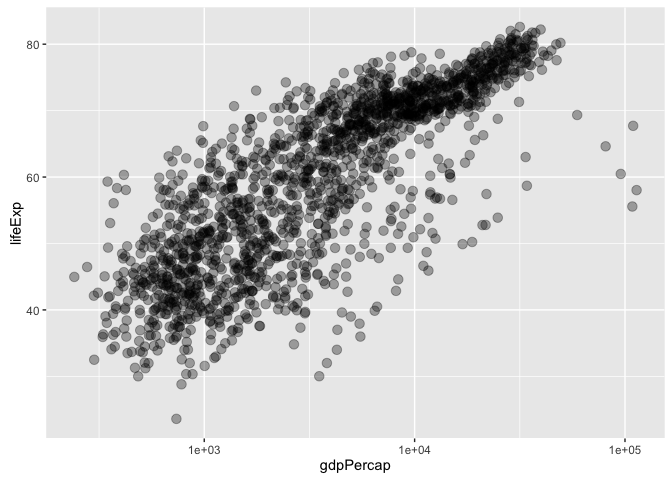 

add a fitted curve or line


```r
p + geom_point() + geom_smooth()
```

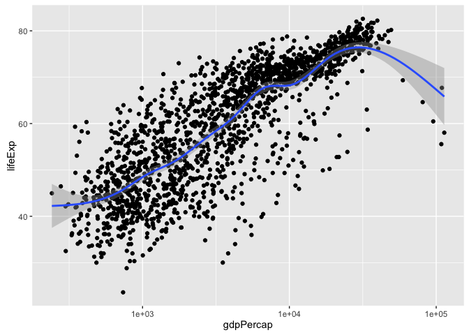 

```r
p + geom_point() + geom_smooth(lwd = 3, se = FALSE)
```

 

```r
p + geom_point() + geom_smooth(lwd = 3, se = FALSE, method = "lm")
```

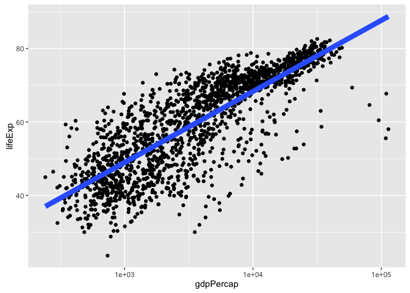 

revive our interest in continents!


```r
p + aes(color = continent) + geom_point() + geom_smooth(lwd = 3, se = FALSE)
```

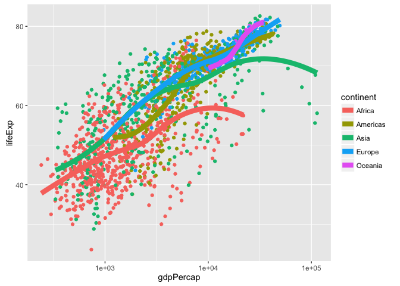 

facetting: another way to exploit a factor


```r
p + geom_point(alpha = (1/3), size = 3) + facet_wrap(~ continent)
```

 

```r
p + geom_point(alpha = (1/3), size = 3) + facet_wrap(~ continent) +
  geom_smooth(lwd = 2, se = FALSE)
```

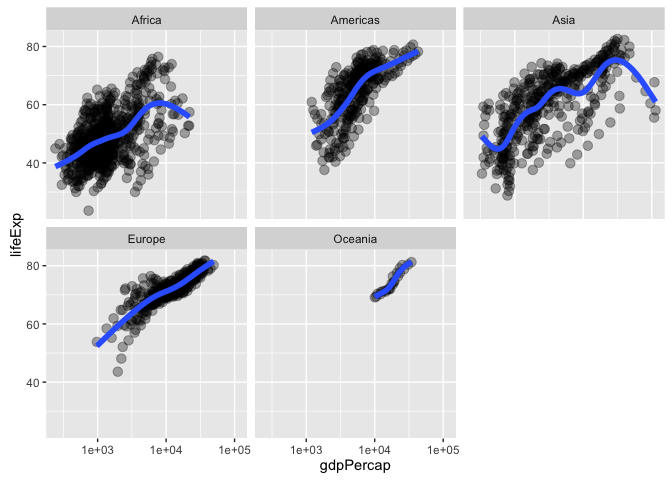 

exercises:  
* plot lifeExp against year  
* make mini-plots, split out by continent  
* add a fitted smooth and/or linear regression, w/ or w/o facetting  
* other ideas?  
plot lifeExp against year


```r
(y <- ggplot(gapminder, aes(x = year, y = lifeExp)) + geom_point())
```

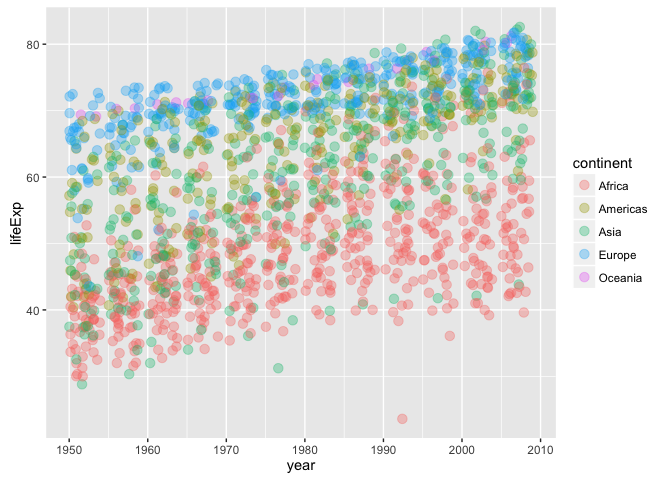 

make mini-plots, split out by continent


```r
y + facet_wrap(~ continent)
```

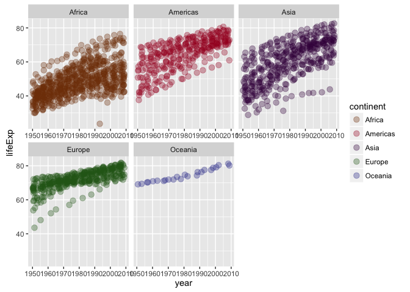 

add a fitted smooth and/or linear regression, w/ or w/o facetting


```r
y + geom_smooth(se = FALSE, lwd = 2) +
  geom_smooth(se = FALSE, method ="lm", color = "orange", lwd = 2)
```

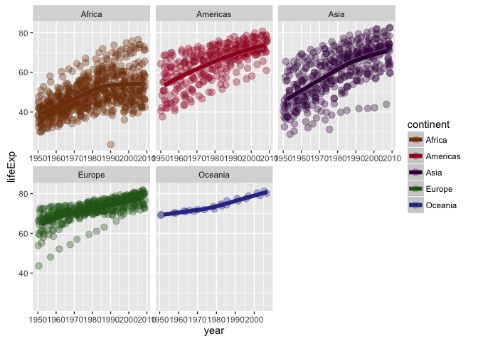 

```r
y + geom_smooth(se = FALSE, lwd = 2) +
  facet_wrap(~ continent)
```

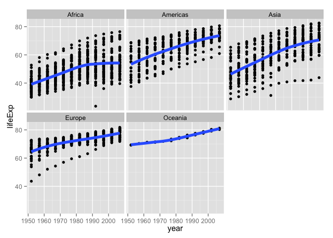 

last bit on scatterplots  
how can we "connect the dots" for one country?  
i.e. make a spaghetti plot?


```r
y + facet_wrap(~ continent) + geom_line() # uh, no
```

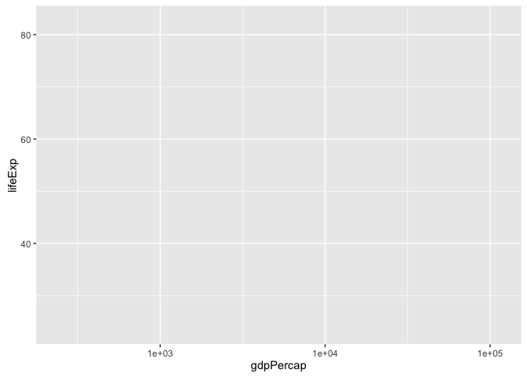 

```r
y + facet_wrap(~ continent) + geom_line(aes(group = country)) # yes!
```

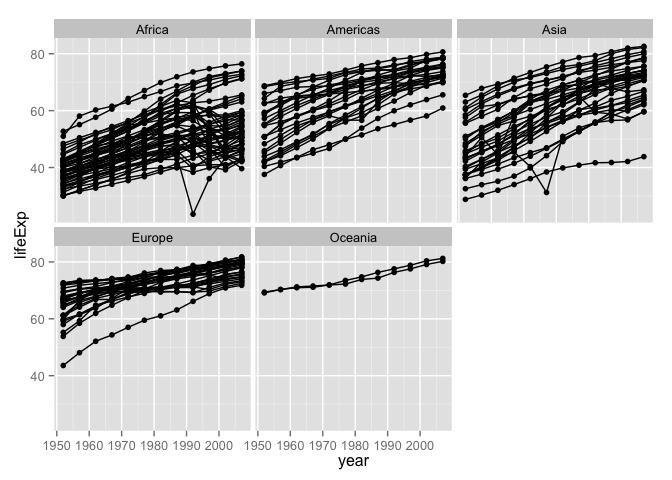 

```r
y + facet_wrap(~ continent) + geom_line(aes(group = country)) +
  geom_smooth(se = FALSE, lwd = 2) 
```

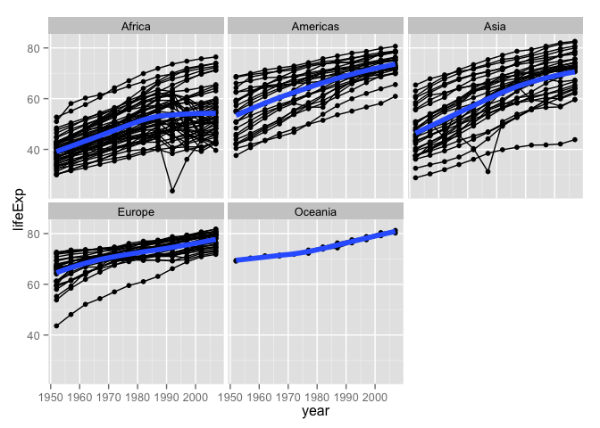 

note about subsetting data
sadly, ggplot() does not have a 'subset =' argument  
so do that 'on the fly' with subset(..., subset = ...)


```r
ggplot(subset(gapminder, country == "Zimbabwe"),
       aes(x = year, y = lifeExp)) + geom_line() + geom_point()
```

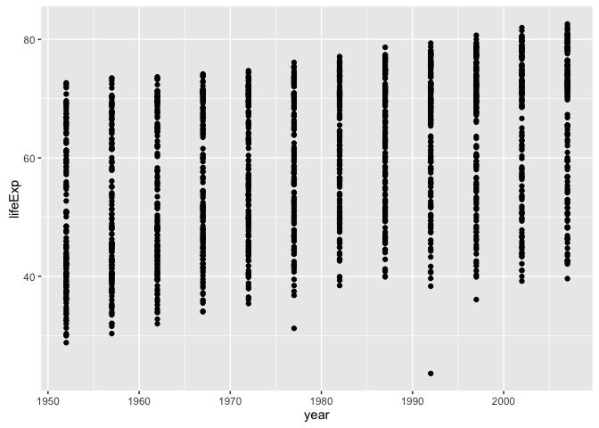 

let just look at four countries


```r
jCountries <- c("Canada", "Rwanda", "Cambodia", "Mexico")
ggplot(subset(gapminder, country %in% jCountries),
       aes(x = year, y = lifeExp, color = country)) + geom_line() + geom_point()
```

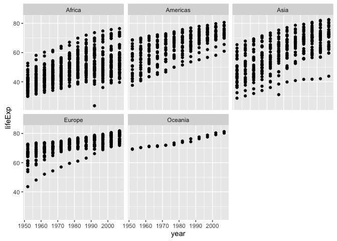 

when you really care, make your legend easy to navigate  
this means visual order = data order = factor level order


```r
ggplot(subset(gapminder, country %in% jCountries),
       aes(x = year, y = lifeExp, color = reorder(country, -1 * lifeExp, max))) +
  geom_line() + geom_point()
```

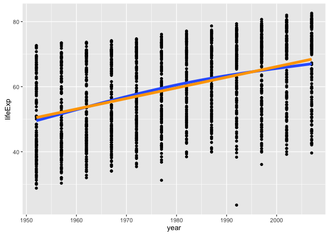 

another approach to overplotting
ggplot(gapminder, aes(x = gdpPercap, y = lifeExp)) +


```r
ggplot(gapminder, aes(x = gdpPercap, y = lifeExp)) + scale_x_log10() + geom_bin2d()
```

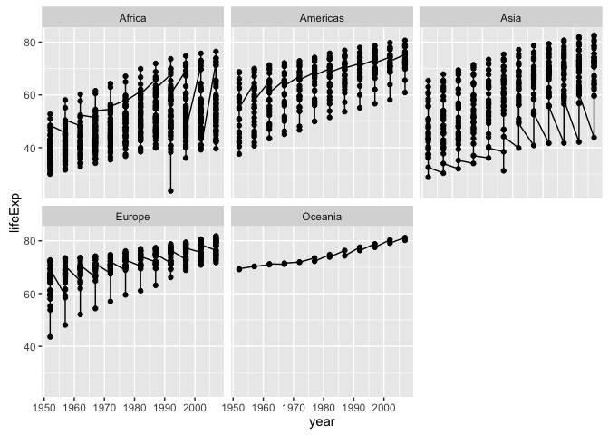 

```r
sessionInfo()
```

```
## R version 3.1.2 (2014-10-31)
## Platform: x86_64-apple-darwin10.8.0 (64-bit)
## 
## locale:
## [1] en_CA.UTF-8/en_CA.UTF-8/en_CA.UTF-8/C/en_CA.UTF-8/en_CA.UTF-8
## 
## attached base packages:
## [1] stats     graphics  grDevices utils     datasets  methods   base     
## 
## other attached packages:
## [1] mgcv_1.8-4      nlme_3.1-118    gapminder_0.1.0 ggplot2_1.0.0  
## [5] knitr_1.10.5   
## 
## loaded via a namespace (and not attached):
##  [1] colorspace_1.2-4  digest_0.6.8      evaluate_0.7     
##  [4] formatR_1.2       grid_3.1.2        gtable_0.1.2     
##  [7] htmltools_0.2.6   labeling_0.3      lattice_0.20-29  
## [10] magrittr_1.5      MASS_7.3-35       Matrix_1.1-4     
## [13] munsell_0.4.2     plyr_1.8.2        proto_0.3-10     
## [16] Rcpp_0.11.6       reshape2_1.4.0.99 rmarkdown_0.5.1  
## [19] scales_0.2.4      stringi_0.4-1     stringr_1.0.0    
## [22] tools_3.1.2       yaml_2.1.13
```


---
title: "gapminder-ggplot2-scatterplot.r"
author: "jenny"
date: "Thu May 14 12:37:24 2015"
---
