Note: this HTML is made by applying `knitr::spin()` to an R script. So the
narrative is very minimal.


```r
library(ggplot2)
```

pick a way to load the data


```r
gdURL <- "http://tiny.cc/gapminder"
gDat <- read.delim(file = gdURL) 
gDat <- read.delim("gapminderDataFiveYear.tsv")
str(gDat)
```

```
## 'data.frame':	1704 obs. of  6 variables:
##  $ country  : Factor w/ 142 levels "Afghanistan",..: 1 1 1 1 1 1 1 1 1 1 ...
##  $ year     : int  1952 1957 1962 1967 1972 1977 1982 1987 1992 1997 ...
##  $ pop      : num  8425333 9240934 10267083 11537966 13079460 ...
##  $ continent: Factor w/ 5 levels "Africa","Americas",..: 3 3 3 3 3 3 3 3 3 3 ...
##  $ lifeExp  : num  28.8 30.3 32 34 36.1 ...
##  $ gdpPercap: num  779 821 853 836 740 ...
```

distribution of a quant var: histogram


```r
ggplot(gDat, aes(x = lifeExp)) + geom_histogram()
```

```
## stat_bin: binwidth defaulted to range/30. Use 'binwidth = x' to adjust this.
```

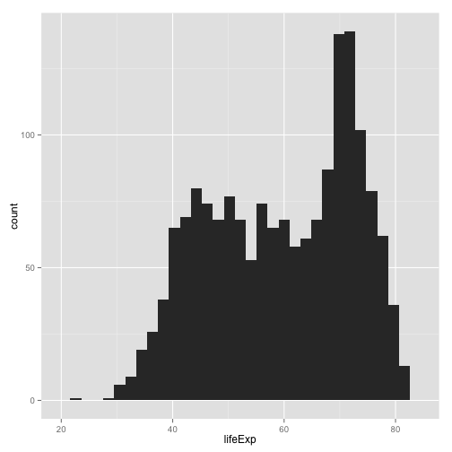 

smooth histogram = densityplot


```r
ggplot(gDat, aes(x = lifeExp)) + geom_density()
```

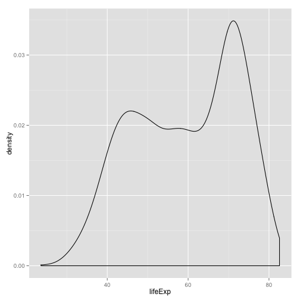 

show the different continents, but I think it's weird to stack up the
histograms, which is what default of `position = "stack"` delivers


```r
ggplot(gDat, aes(x = lifeExp, fill = continent)) + geom_histogram()
```

```
## stat_bin: binwidth defaulted to range/30. Use 'binwidth = x' to adjust this.
```

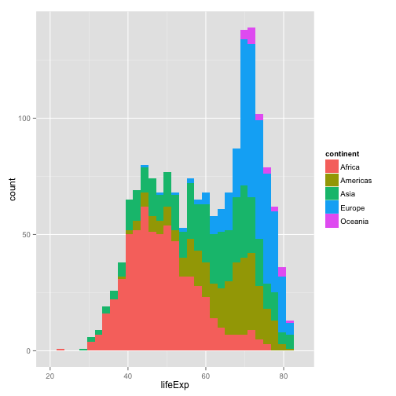 

`position = "identity"` is good to know about


```r
ggplot(gDat, aes(x = lifeExp, fill = continent)) +
  geom_histogram(position = "identity")
```

```
## stat_bin: binwidth defaulted to range/30. Use 'binwidth = x' to adjust this.
```

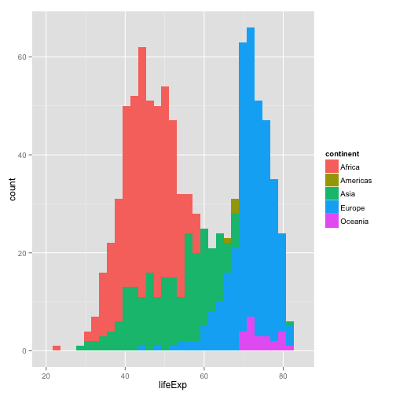 

densityplots work better in terms of one continent not obscuring another


```r
ggplot(gDat, aes(x = lifeExp, color = continent)) + geom_density()
```

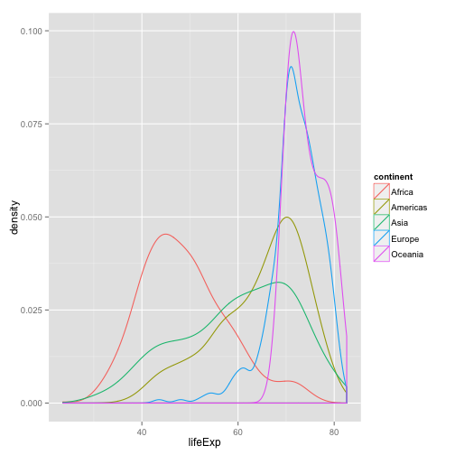 

alpha transparency works here too


```r
ggplot(gDat, aes(x = lifeExp, fill = continent)) + geom_density(alpha = 0.2)
```

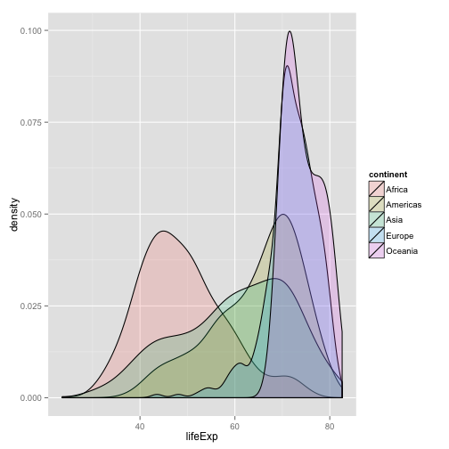 

with only two countries, maybe we should ignore Oceania?


```r
ggplot(subset(gDat, continent != "Oceania"),
       aes(x = lifeExp, fill = continent)) + geom_density(alpha = 0.2)
```

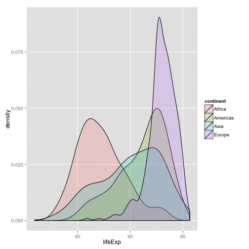 

facets work here too


```r
ggplot(gDat, aes(x = lifeExp)) + geom_density() + facet_wrap(~ continent)
```

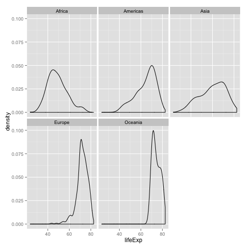 

```r
ggplot(subset(gDat, continent != "Oceania"),
       aes(x = lifeExp, fill = continent)) + geom_histogram() +
  facet_grid(continent ~ .)
```

```
## stat_bin: binwidth defaulted to range/30. Use 'binwidth = x' to adjust this.
## stat_bin: binwidth defaulted to range/30. Use 'binwidth = x' to adjust this.
## stat_bin: binwidth defaulted to range/30. Use 'binwidth = x' to adjust this.
## stat_bin: binwidth defaulted to range/30. Use 'binwidth = x' to adjust this.
```

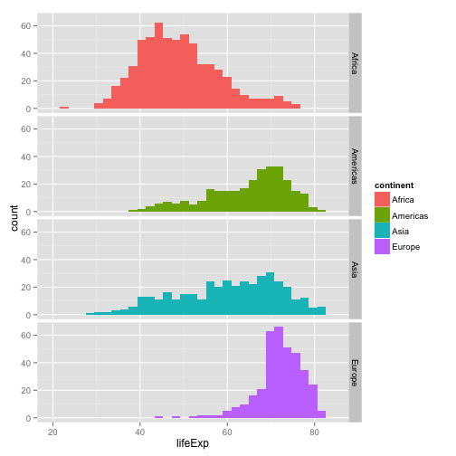 

boxplot for one quantitative variable against a discrete variable  
first attempt does not work since year is not formally a factor


```r
ggplot(gDat, aes(x = year, y = lifeExp)) + geom_boxplot()
```

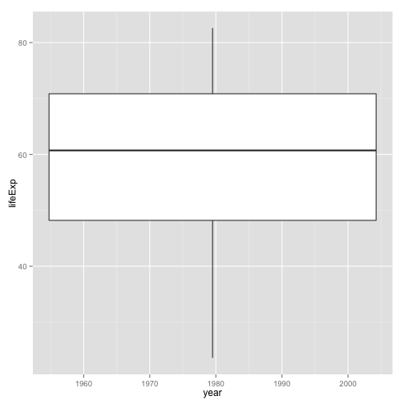 

by explicitly specifying year as the grouping variable, we get what we want


```r
ggplot(gDat, aes(x = year, y = lifeExp)) + geom_boxplot(aes(group = year))
```

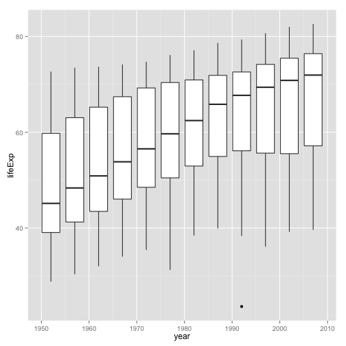 

